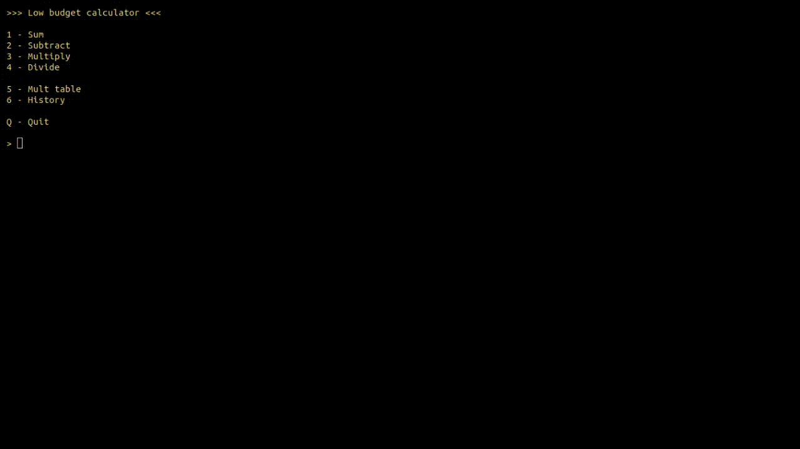

# Low budget Calculator



## Introduction

A powerful console calculator that can do 4 mathematic operations.

## Functionalities

**Basic operations**: Can do sum, sub, mult and div.

**Multiplication table**: Can perform a mult table with a number provided by the user.

## How to use

1. Clone the repo and download the source code.
2. Open the terminal and navigate to the project folder.
3. Use the command below to restore the project dependencies.

```
dotnet restore
```

4. Compile the project using the command:

```
dotnet build --configuration release_name
```

5. Execute the project compiling in real time.

```
dotnet run --project ???to_do???
```

6. To run the compiled executable, cd into `./prog-academy/little-projects/calc/bin/release_name/net-9.0/little-projects` and run:

Windows
```
./little-projects.exe
```
or just run graphically by double clicking it in your file manager.

Linux
```
./little-projects
```

TODO: Fix the namespace of the project.
