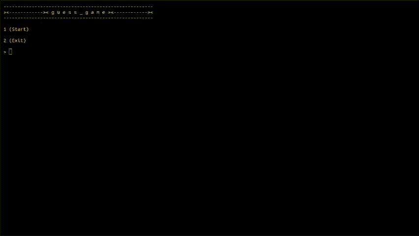

# Low budget guess game!



## Introduction

A simple but fun guess game where you can try your luck.

## How to play

1. Clone the repo and download the source code.
2. Open the terminal and navigate to the project folder.
3. Use the command below to restore the project dependencies.

```
dotnet restore
```

4. Compile the project using the command:

```
dotnet build --configuration Release
```

5. Execute the project compiling in real time.

```
dotnet run --project ?
```

6. To run the compiled executable, cd into `./prog-academy/little-projects/calc/bin/Release/net-9.0/little-projects` on your terminal and type:

Windows
```
./little-projects.exe
```

Linux
```
./little-projects
```

Or just run graphically by double clicking it on your file manager.

TO-DO: Fix the project namespace.
